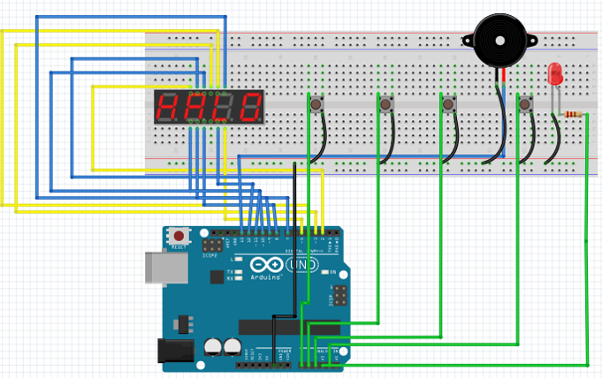
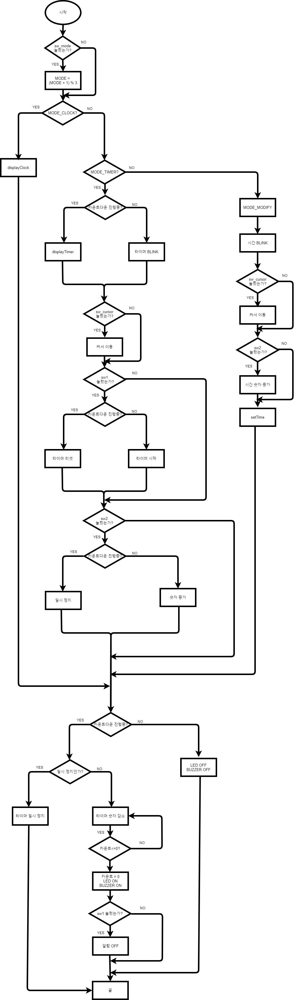
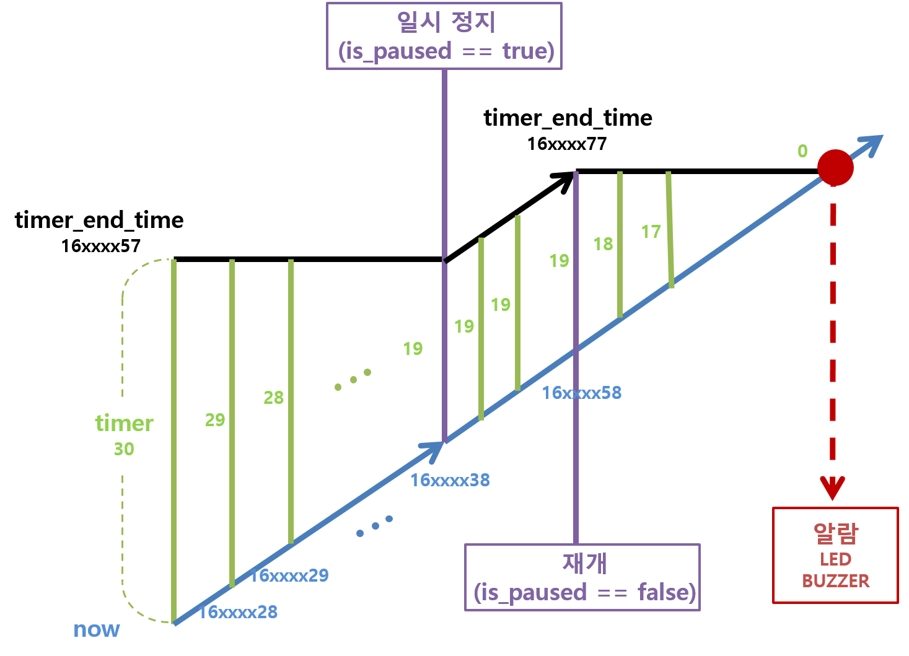

# 아두이노 디지털 시계(with. 타이머)
수험생들이 모의문제 풀 때 사용할 수 있도록 타이머 기능을 추가한 디지털시계

## 기능
- 시계 모드
- 타이머 모드
- 시계 설정모드

## 회로

## flowchart

## 타이머 구현

## 개선사항
- ~~스위치 사용때마다 delay 사용해야 하는 것 개선~~ 2021.06.07
- 설정 모드의 커서 초기화
